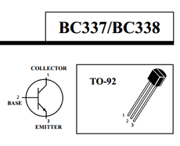
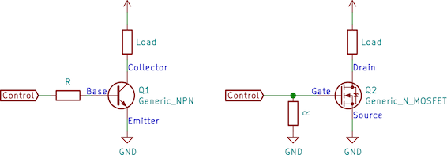

# braitenburg v1

A BJT can be thought of as a voltage controlled current amplifier, where the HFE value is the current gain.

We're using the BC338 BJT transistor to amplify the current through the load. The transistor has an HFE of 100. Here's the datasheet:

[BC338 datasheet](http://www.mouser.com/ds/2/149/BC337-193546.pdf)

To allow more current to be sourced, we need to adjust the amount of voltage on the base. To do so, we build a voltage divider on the base with our LDR and a potentiometer.

Here's a "high side switching" circuit for an NPN transistor:

