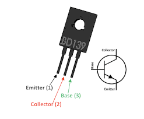
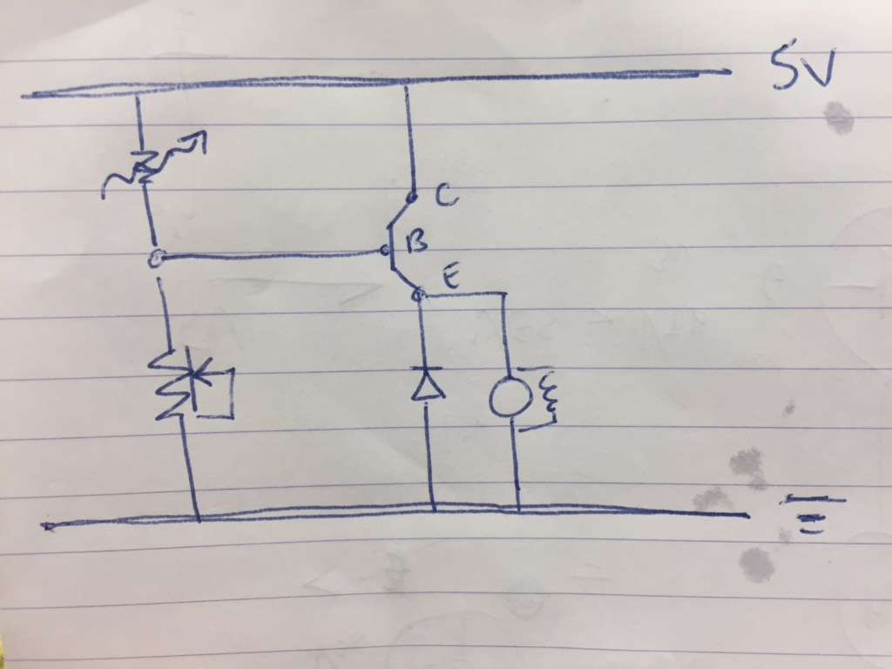

# braitenburg

Created: Aug 06, 2019 1:02 PM

BJT: voltage controlled current amplifier (HFE)

[https://components101.com/transistors/bd139-pinout-equivalent-datasheet](https://components101.com/transistors/bd139-pinout-equivalent-datasheet) 

need to adjust the amount of voltage on the base to allow more current 

the Base-Emitter breakdown voltage is 5V? We're nowhere near that it seems...  

used the BD139, not necessary 

voltage divider on the base with LDR and a pot

tough to tune the resistances 

seems like there is a threshold to turn on, then decay? 

circuit:

