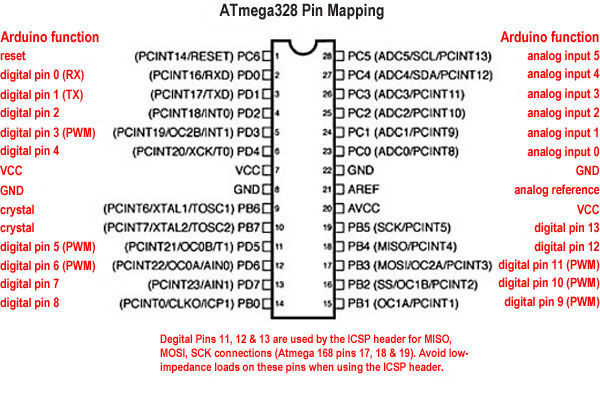

# Arduino in Assembly Language

Detailed explanation of how to program Arduino's microcontrollers (MCUs) using AVR assembly language.

## Prerequisites

1. You need an Arduino UNO (or any other board with the ATmega328P microcontroller)
2. Connect the MCU to a PC running windows with a USB cable

This repository includes the software tools required: the AVR assembler (avrasm2.exe) and a code upload utility (avrdude.exe) in the "tools" sub-folder.
* If you want to download these tools, then you can find them here: [Atmel Studio](http://www.microchip.com/development-tools/atmel-studio-7)
* They will be installed here: C:\Program Files (x86)\Atmel\Studio\7.0\toolchain\avr8\avr8-gnu-toolchain

3. You also need a text editor. We recommend Notepad++.


## Using the example code

### Assemble the *.asm file:
Go to the "tools" folder. Open a window command prompt at this location (just type "cmd" into the address bar of File Explorer).
```
avrasm2.exe -fI ..\code\yourfile.asm
```
This will create a binary file (yourfile.hex). If you do not include the -fI flag (which specifies intel hex file formats), then you will get a *.obj file.
* The "..\code\yourfile.asm" argument assumes your file is in a folder called "code" with the name "yourfile.asm"

### Upload the binary (hexadecimal) file to the Atmega via USB:
```
avrdude -v -p ATmega328p -c arduino -P com3 -b 115200 -D -U flash:w:yourfile.hex:i
```
* The com port number of your Arduino UNO is listed in the Windows "Device Manager".

### Pay attention to the Pin/Port names and their position on the Arduino board


## Authors

* **Adam Kampff** - [kampff](https://github.com/kampff)


