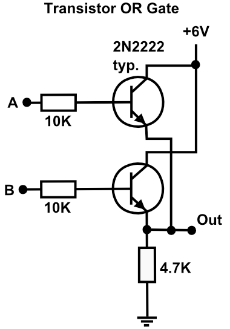
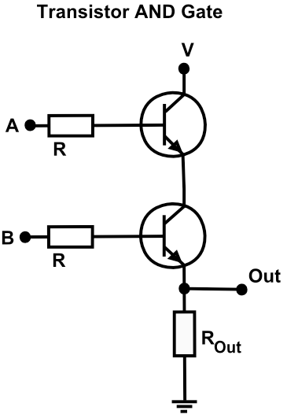
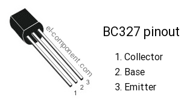
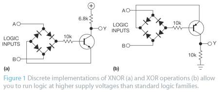
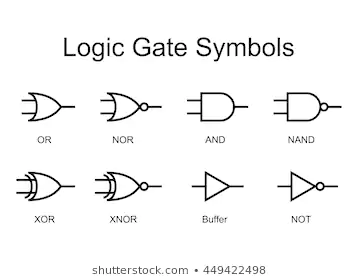
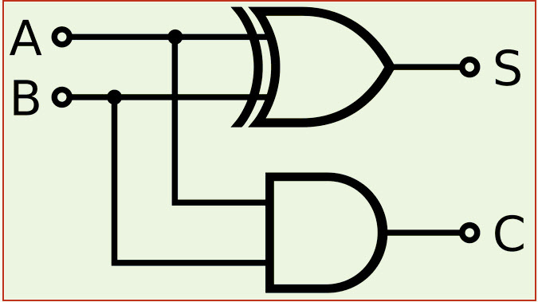
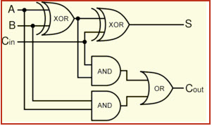
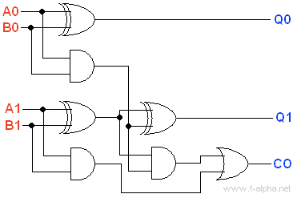
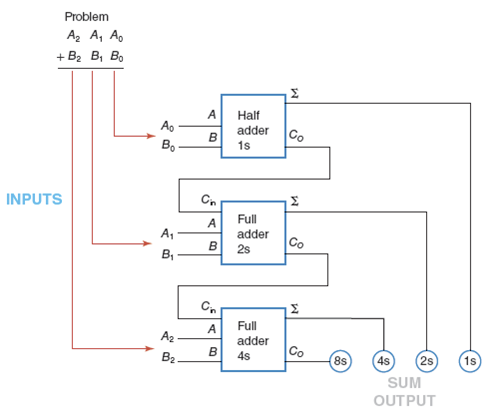
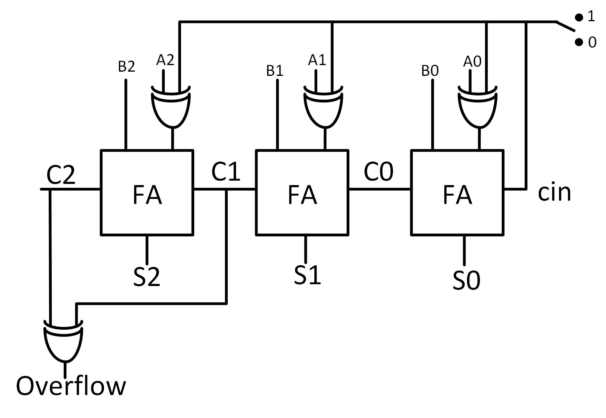

# Digital Logic

Created: Jul 24, 2019 4:56 PM

# (Very Basic) Intro to Digital Logic

Today we're working towards the engine of a processor This is working towards an ALU — there is much more to a CPU!

[Photo of CPU architecture]

What is "digital"?

Why do we need logic?

How do we implement logic in circuits?

What can we make with hardware logic?

- any instruction set can be represented as binary
- boolean algebra applied to such instructions / data can generate arbitrary computations with enough time and memory (see later discussions of interpretation/compilation)

Choices are made by people:

[https://en.wikipedia.org/wiki/Von_Neumann_architecture](https://en.wikipedia.org/wiki/Von_Neumann_architecture)

[https://en.wikipedia.org/wiki/Universal_Turing_machine](https://en.wikipedia.org/wiki/Universal_Turing_machine)

- Make an OR and AND gate
    - Explain how to get to XOR, NAND, etc
- Make a full adder out of XOR ICs
- Hook full adders together to get multiple bit adder?
- Explain negative numbers, subtraction, bit-shifting
- Link to reference of how to implement every single basic gate with NAND
-

Many ways to make XOR gate:

- [https://hackaday.io/project/8449-hackaday-ttlers/log/150147-bipolar-xor-gate-with-only-2-transistors/](https://hackaday.io/project/8449-hackaday-ttlers/log/150147-bipolar-xor-gate-with-only-2-transistors/)

IMPORTANT: make sure to pull up/down unused gates otherwise nondeterministic behavior may ensue.

NOTE: with BJTs you might see different currents on the outputs because the currents will add as you saturate transistors. Thus LEDs will glow differently depending on the circuit's state.

OR Gate

AND Gate

Great example: [http://www.technologystudent.com/elec1/dig8.htm](http://www.technologystudent.com/elec1/dig8.htm)

XOR Gate (using diode bridge + PNP)

I wasn't able to get this circuit working, but I didn't try very hard! PNPs flip my brain inside out... I think the issue was getting the incoming logic level to be reversed.

Gate Abstractions

Half Adder

Parts

(XOR)[[https://www.ti.com/lit/ds/symlink/cd4030b-mil.pdf](https://www.ti.com/lit/ds/symlink/cd4030b-mil.pdf)]

(AND)[[https://www.ti.com/lit/ds/symlink/cd4081b.pdf](https://www.ti.com/lit/ds/symlink/cd4081b.pdf)]

(OR)[[http://www.ti.com/lit/ds/symlink/cd4071b.pdf](http://www.ti.com/lit/ds/symlink/cd4071b.pdf)]

Tutorial — can you spot the error?

[http://www.learningaboutelectronics.com/Articles/Half-adder-circuit.php](http://www.learningaboutelectronics.com/Articles/Half-adder-circuit.php)

Full Adder

2-bit adder (without carry in)

3 bit adder

