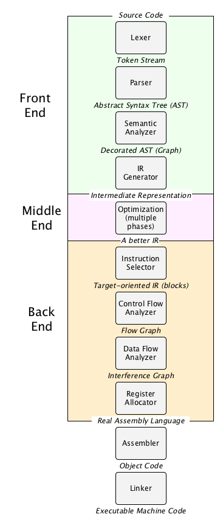

# What does `python python_script.py` actually do?

**Note** The following is limited to CPython. Other interpreters (PyPy, Jython, etc) will have their own ways of interpreting Python code. 

An important clue: [main.c](https://hg.python.org/cpython/file/2.7/Modules/main.c)

How is a [python dictionary](https://github.com/python/cpython/blob/master/Objects/dictobject.c) implemented? 

**Essentially, python is text that is compiled into a special bytecode which is evaluated by a C program.**


# Why should I care?

Because Turing said:

> ‘What we want is a machine that can learn from experience’, adding that the ‘possibility of letting the machine alter its own instructions provides the mechanism for this’.

This is what we now think of, in part, at least, as metaprogramming-- the ability of computer code to alter itself. Lisp is taken as the gold standard of this approach, taking the program-as-data concept crucial to all modern computers, invented originally by Turing and popularized by von Neumann, and embodying it in a human-readable language. 

> Lisp code is made out of Lisp data objects. And not in the trivial sense that the source files contain characters, and strings are one of the data types supported by the language. Lisp code, after it's read by the parser, is made of data structures that you can traverse. If you understand how compilers work, what's really going on is not so much that Lisp has a strange syntax as that Lisp has no syntax. You write programs in the parse trees that get generated within the compiler when other languages are parsed. But these parse trees are fully accessible to your programs. You can write programs that manipulate them. In Lisp, these programs are called macros. They are programs that write programs. -- Paul Graham

Wikipedia's nice explanation of compiling a program:

> Prior to execution, a program must first be written. This is generally done in source code, which is then compiled at compile time (and statically linked at link time) to an executable. This executable is then invoked, most often by an operating system, which loads the program into memory (load time), possibly performs dynamic linking, and then begins execution by moving control to the entry point of the program; all these steps depend on the Application Binary Interface of the operating system. At this point execution begins and the program enters run time. The program then runs until it ends, either normal termination or a crash."

[Application Binary Interface (ABI)](https://en.wikipedia.org/wiki/Application_binary_interface)


# Interpretation vs. Compilation


[source](https://ruslanspivak.com/lsbasi-part1/)

>Most real interpreters are somewhere in between pure interpreters and compilers. They read through the source code for a program once, and translate it into an "intermediate representation" that's easier to work with--a data structure of some kind--and then interpret that. Rather than stepping through strings of source text, they step through a data structure that represents that source text in a more convenient form, which is much faster to operate on. That is, they do some analysis once, while converting the source text into a data structure, and the rest as they execute the program by stepping through the data structure. 

[source](https://www.cs.rpi.edu/academics/courses/fall00/ai/scheme/reference/schintro-v14/schintro_112.html)

# What does a compiler do? 



[An amazing intro course to compilers.](https://www.cs.rpi.edu/academics/courses/fall00/ai/scheme/reference/schintro-v14/schintro_112.html)

[A nice blog intro to compilation](https://nicoleorchard.com/blog/compilers)


# Compiling C

- What are object files? [https://stackoverflow.com/questions/7718299/whats-an-object-file-in-c](https://stackoverflow.com/questions/7718299/whats-an-object-file-in-c)


what happens when I run 

- `gcc -E `  --> preprocess, but don't compile
- `gcc -S `  --> compile (to assembly) but don't assemble
- `gcc -c ` --> preprocess, compile, and assemble (to bytecode), but don't link
- `gcc` with no switch will link object files and generate the executable


e.g. assembly file from C file:

```sh
gcc -S -o output.s input.c
```

assembly from an object file:

```sh
objdump -S --disassemble object_file > assembly_file.dump
```


    


# Inside the Python VM

This is the best writeup I've seen for walking through the Python VM. You need a basic working knowledge of reading C code, but not much, and this could be a good way to learn. Note  it is basically book-length. 

[The view from 30,000ft](https://leanpub.com/insidethepythonvirtualmachine/read#leanpub-auto-the-view-from-30000ft)


> ...let’s start with a bird’s eye overview of what happens when you do this: $ python -c 'print("Hello, world!")'. Python’s binary is executed, the standard C library initialization which pretty much any process does happens and then the main function starts executing (see its source, ./Modules/python.c: main, which soon calls ./Modules/main.c: Py_Main). After some mundane initialization stuff (parse arguments, see if environment variables should affect behavior, assess the situation of the standard streams and act accordingly, etc), [./Python/pythonrun.c: Py_Initialize](http://docs.python.org/c-api/init.html#Py_Initialize) is called. In many ways, this function is what ‘builds’ and assembles together the pieces needed to run the CPython machine and makes ‘a process’ into ‘a process with a Python interpreter in it’. Among other things, it creates two very important Python data-structures: the **interpreter state** and **thread state**. It also creates the built-in **module** [sys](http://docs.python.org/library/sys.html) and the module which hosts all [builtins](http://docs.python.org/library/functions.html#built-in-functions). With these in place, Python will do one of several things based on how it was executed. Roughly, it will either execute a string (the -c option), execute a module as an executable (the -m option), or execute a file (passed explicitly on the command line or passed by the kernel when used as an interpreter for a script) or run its [REPL](http://en.wikipedia.org/wiki/Read-eval-print_loop) loop (this is more a special case of the file to execute being an interactive device). In the case we’re currently following, it will execute a single string, since we invoked it with -c. To execute this single string, ./Python/pythonrun.c: PyRun_SimpleStringFlags is called. This function creates the __main__ **namespace**, which is ‘where’ our string will be executed (if you run $ python -c 'a=1; print(a)', where is a stored? in this namespace). After the namespace is created, the string is executed in it (or rather, interpreted or *evaluated* in it). To do that, you must first transform the string into something that machine can work on.

[source](https://tech.blog.aknin.name/category/my-projects/pythons-innards/page/1/)

Steps in the `python` command: 

- initialize CPython
- initialize Python
- run a bunch of C code to set up namespaces, frames, threads
- lex/scan/tokenize and make the CST
- parse and make the AST
- produce code objects and frame objects 
- boil down the code into "opcodes" and call C functions based on those "opcodes"
- pop and set data from the operand stack 
- return values from C functions
- clean up everything and finalize

### `exec` vs `eval`

`exec` returns `None` and can take assignments, definitions, etc. This is the same as `compile` in `exec` mode. 

`eval` can take only expressions and returns their value. This is the same for `compile` in `eval` mode. 

`compile`  is special in that produces code objects. 

> If one looks into `eval` and exec source code in CPython 3, this is very evident; they both call PyEval_EvalCode with same arguments, the only difference being that exec explicitly returns None."

Note that `ast.parse` is written in Python and just calls `compile(source, filename, mode, PyCF_ONLY_AST))``

[source](https://stackoverflow.com/questions/2220699/whats-the-difference-between-eval-exec-and-compile)


### Tokenize, Parse, and AST modules 

[tokenize](https://docs.python.org/release/3.6.1/library/tokenize.html)

Example: 

```sh
python3 -m tokenize [-e] [filename.py]
```

[parser](https://docs.python.org/release/3.6.1/library/parser.html)

[ast](https://docs.python.org/release/3.6.1/library/ast.html)


## Stacks of stacks 

When running a C program, Stack memory is preallocated via compilation while Heap memory is dynamically allocated by the programmer up to a certain amount. The stack grows and shrinks as functions push and pop local variables, hence the name "stack". 

[source](https://www.gribblelab.org/CBootCamp/7_Memory_Stack_vs_Heap.html)

CPython uses three types of stacks:

> The **call stack**. This is the main structure of a running Python program. It has one item—a "frame"—for each currently active function call, with the bottom of the stack being the entry point of the program. Every function call pushes a new frame onto the call stack, and every time a function call returns, its frame is popped off.

> In each frame, there's an **evaluation stack** (also called the **data stack**). This stack is where execution of a Python function occurs, and executing Python code consists mostly of pushing things onto this stack, manipulating them, and popping them back off.

> Also in each frame, there's a **block stack**. This is used by Python to keep track of certain types of control structures: loops, `try`/`except` blocks, and `with` blocks all cause entries to be pushed onto the block stack, and the
block stack gets popped whenever you exit one of those structures. This helps Python know which blocks are active at any given moment so that, for example, a `continue` or `break` statement can affect the correct block.

[source](https://opensource.com/article/18/4/introduction-python-bytecode)

> The virtual machine and the stack are both placed in the heap memory. LOAD_FAST places an object on the top of the stack from the virtual machine point of view, and the very same instruction places object in the heap from an OS point of view.

[source](https://stackoverflow.com/questions/34149013/what-does-it-mean-that-python-is-stack-based)


## Python is a giant case/switch 

[Here](http://unpyc.sourceforge.net/Opcodes.html) are all the CPython opcodes that make up its virtual machine's bytecode. [Here](https://github.com/python/cpython/blob/master/Python/ceval.c#L1319) is a giant case/switch statement showing how those opcodes are executed by the CPython interpreter. 


# Python AST

> ASTs are like Lisp macros — it's how Python thinks of itself

[Python AST "documentation"](https://greentreesnakes.readthedocs.io/en/latest/nodes.html#function-and-class-definitions)

## Explore the AST

[Online AST explorer](https://python-ast-explorer.com/)

[AST visualization module]( )

```python
import ast
ast.parse("x = 42")
ast.dump(ast.parse("x = 42"))
print(compile(ast.parse("x = 42"), '<input>', 'exec'))
eval(compile(ast.parse("x = 42"), '<input>', 'exec'))
print(x)
```

## Alter the AST 

The following code shows how you can replace operations in python code on the fly by subclassing the `ast` module's NodeTransformer. 

```python
import ast
class ReplaceBinOp(ast.NodeTransformer):
    """Replace operation by addition in binary operation"""
    def visit_BinOp(self, node):
          return ast.BinOp(left=node.left,op=ast.Add(),right=node.right)

tree = ast.parse("x = 1/3")
ast.fix_missing_locations(tree)
eval(compile(tree, '', 'exec'))
print(ast.dump(tree))
print(x)

tree = ReplaceBinOp().visit(tree)
ast.fix_missing_locations(tree)
print(ast.dump(tree))
eval(compile(tree, '', 'exec'))
print(x)
```

## Building Python  from AST:

> An abstract syntax tree can be generated by passing `ast.PyCF_ONLY_AST` as a flag to the compile() built-in function, or using the parse() helper provided in this module. The result will be a tree of objects whose classes all inherit from ast.AST. An abstract syntax tree can be compiled into a Python code object using the built-in compile() function.

```python
hello_world = ast.Str(s='hello world!', lineno=1, col_offset=1)
print_call = ast.Print(values=[hello_world], lineno=1, col_offset=1, nl=True)
module = ast.Module(body=[print_call])
code = compile(module, '', 'exec')
eval(code)
```


# lis.py -- A Python Lisp Interpreter

In Lisp/Scheme, the program explicitly represents the environments/frames of the program. In Python this is more subtle.

[lispy1](https://norvig.com/lispy.html)

[lispy2](http://norvig.com/lispy2.html)

**Note** Closures are very near and dear to lisps. A closure is a little program that intends to hold the state of the function when it was defined, such that each evaluation is based on that define-time state.


## Random 

what does this do?

    if __name__ == "__main__":
        # some code

If you are running your module (the source file) as the main program, the interpreter will assign the hard-coded string `"__main__"` to the `__name__` variable

[source](https://stackoverflow.com/questions/419163/what-does-if-name-main-do)

what does this do?

    import some_module

The import statement combines two operations; it searches for the named module, then it binds the results of that search to a name in the local scope.


# Further Reading 

[writing `make` files](https://www.cs.oberlin.edu/~kuperman/help/make.html)

[generating processes -- OSTEP](https://github.com/remzi-arpacidusseau/ostep-code/tree/master/cpu-api)

[compiler intro blogpost](https://cs.lmu.edu/~ray/notes/introcompilers/)

[another compiler intro blogpost](https://nicoleorchard.com/blog/compilers)

[learning to read x86 assembly language.](http://patshaughnessy.net/2016/11/26/learning-to-read-x86-assembly-language)

[Lexers vs. Parsers](https://stackoverflow.com/questions/2842809/lexers-vs-parsers)

[Explanation of a stripped-down python Lisp interpreter](http://www.michaelnielsen.org/ddi/lisp-as-the-maxwells-equations-of-software/)

[Cython](http://docs.cython.org/en/latest/src/quickstart/cythonize.html) is a python interpreter that helps you **compile** Python to more efficient C.

[Stepping through a python function to the CPython internals](https://medium.com/@skabbass1/how-to-step-through-the-cpython-interpreter-2337da8a47ba)

[S-expressions](https://en.wikipedia.org/wiki/S-expression) are binary trees of atoms and/or s-expressions

[Parsing in Python](https://tomassetti.me/parsing-in-python/#useful)

