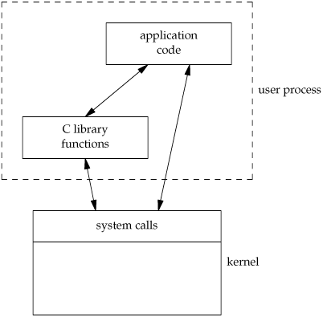
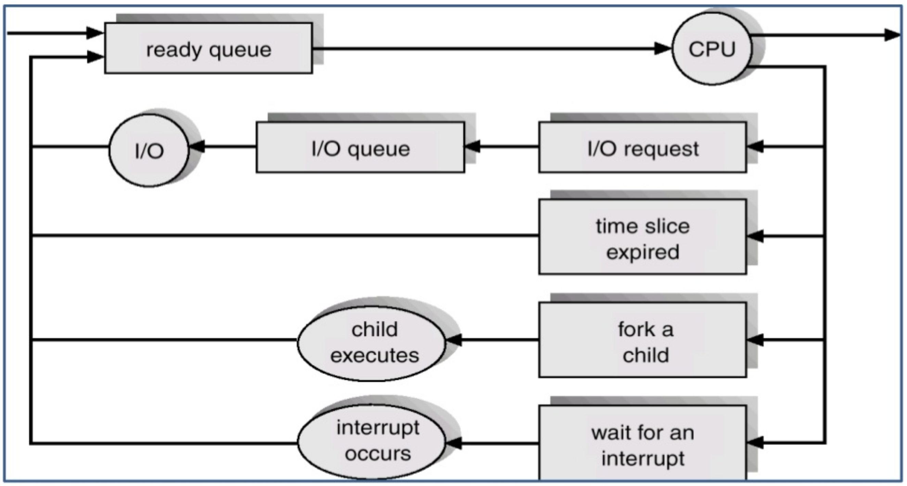
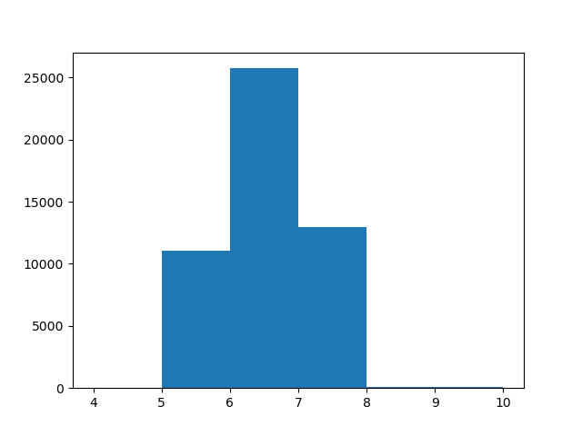

# Operating Systems






## Threads, Processes, and the GIL

*Threads* are *processes* that share memory. To use multiple threads one needs to synchronize them using locks. To use processes, one needs to pipe data between them. Processes have larger overhead than threads. Threads can be seen as mini-processes on the same memory.


> The GIL prevents any two threads from simultaneously executing python bytecode instructions. However, when there is IO to be performed, a thread will release the GIL so that other threads can execute python bytecode instructions. The GIL doesn't prevent computation in general, just the interpretation of
python bytecode.

> The GIL, or Global Interpreter Lock, is a boolean value in the Python interpreter, protected by a mutex. The lock is used by the core bytecode evaluation loop in CPython to set which thread is currently executing statements. CPython supports multiple threads within a single interpreter, but threads must request access to the GIL in order to execute Opcodes (low-level operations).

Multithreading rarely helps to speed up Python code due to the GIL. Multiprocessing can, however, have a big impact. The bottom line is: multithreading in CPython is easy, but it’s not truly concurrent, and multiprocessing is concurrent but has a significant overhead. See [this](https://hackernoon.com/has-the-python-gil-been-slain-9440d28fa93d) for a nice discussion and proposals for bending the GIL using subinterpreters.

How does this compare to the Assembly and C on the ATtiny/Arduino microcontrollers? Until now, we've been working with a single process on a single processor.

How would we think about managing and scheduling these processes if we had, say, 1e3 of them? Why would we need to do this?

You can look at the processes running on your (Unix) machine using `ps aux | grep -i <keyword>`. The `-i` flag is an argument for the `grep` command to ignore case.

## Timing a Python Loop

Let's time a loop in python and plot a histogram of the time deltas.

```python
import time
import matplotlib.pyplot as plt
import time
millis = lambda: int(round(time.time() * 1000))
times = []
for i in range(int(50e3)):
    start = millis()
    time.sleep(.005)
    stop = millis()
    times.append(stop - start)
plt.hist(times, [4, 5, 6, 7, 8, 9, 10])
plt.show()
```



## CLI and Signals

Anything you want to know about in the shell can be learned using `man <command>` or `help <command>`.

Inspect your running processes using `top` or `htop`. Find the Process ID (pid) from the list. If you want, explore using "pipes" (this character: `|`) and the `grep` command to search the list of processes. For instance, you might use `ps aux | grep -i python`. Check out `pgrep` as well.

Once you have the PID, there are several signals you (the OS) can send to a process:

```bash
1       HUP (hang up)
2       INT (interrupt)
3       QUIT (quit)
6       ABRT (abort)
9       KILL (non-catchable, non-ignorable kill)
14      ALRM (alarm clock)
15      TERM (software termination signal)
```

The most useful commands for processes are `HUP`, `QUIT` and `KILL`, which you can run using `kill -<command_number> <pid>`.